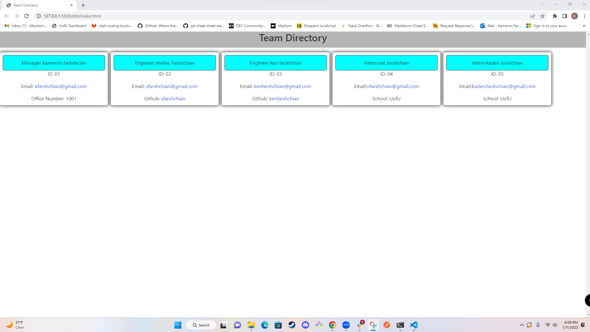

  # Manage My Team

  ## License
  

  ## Description
  This project was made to solidify my knowledge on Object Oriented Programming, Node.js and how to use code testing with Jest. This node.js application automatically generates question being filled out and injected into a HTML webpage, so the user does not need to do everything individually. It uses a parent class and extends the parent class to all the subclasses that are all different levels of employees. It solves the problem of a developer needing to add new HTML for a company directory when an employee is hired, they just need to answer a few questions and the employee will be added. 

  ## Table of Contents
  - [License](#License)
  - [Description](#Description)
  - [Installation](#installation)
  - [Usage](#Usage)
  - [Credits](#credits)
  - [Tests](#Tests)
  - [Questions](#Questions)
  
  ## Installation
  - npm install
  - npm i inquirer@8.2.4 
  - npm install --save-dev jest

  ## Usage
  
  [Untitled_ Jan 11, 2023 10_39 PM.webm](https://user-images.githubusercontent.com/114946696/211987327-23595feb-600d-42c8-af86-9779691a29a7.webm)

  
  This project was made to show the power of Object-Oriented Programming, Node.js, and inquirer. Using all these programs together we only need to answer a few questions to add employees directly into a company directory via HTML rather than having to add them to the HTML individually. This project has the potential to save a developer time and move to other tasks that need more immediate attention. 
  
  ## Credits
  N/A

  ## Tests
  This projects testing was done in Jest. I compared the data I received from the classes verse the data I expected to receive from them. Once the tests passes I knew the data was accurate.

  ## Questions
  If you would like to ask me any questions. Contact me at my email address below or you can check out my Github profile.
  - Email-kfarshchian@gmail.com
  - Github user name- kfarshchian
  
  
